# 🦅 Nighthawk Security Assistant

<div align="center">

[](https://opensource.org/licenses/MIT)
[](https://www.python.org/downloads/)
[](https://archlinux.org/)

**AI-Powered Penetration Testing Framework**

*Transform natural language into professional security assessments*

[Features](#-features) • [Installation](#-installation) • [Usage](#-usage-guide) • [Tools](#-integrated-tools)

</div>

---

## ✨ What is Nighthawk?

Nighthawk is an intelligent security assistant that bridges the gap between conversational input and professional penetration testing. Simply describe what you want to accomplish, and Nighthawk translates your intent into precise security commands, executes them, and provides AI-powered analysis of the results.

**Powered by:**
- 🤖 **Ollama** - Local AI inference for intelligent command generation
- 🎯 **Google Gemini** - Advanced natural language understanding
- 🔧 **Modular Architecture** - Plugin-based tool system for extensibility

---

## 🚀 Features

### 🎨 Beautiful TUI Interface
- **Terminal User Interface** - Sleek, responsive design with real-time updates
- **Matrix Rain Animation** - Eye-catching startup sequence
- **Tabbed Navigation** - Switch between Chat, Scan, and Settings views
- **Syntax Highlighting** - Color-coded output for better readability
- **Text-to-Speech** - AI responses with natural-sounding voices
  - 🔊 Microsoft Edge Neural Voices (8 voice options: US, UK, AU, CA)
  - ⚡ Adjustable speech rate (-50% to +50%)
  - 🎯 Smart chunking for seamless playback
  - ⏹️ Instant stop with Ctrl+W hotkey

### 🧠 Intelligent Command Processing
- **Natural Language Interface** - Talk naturally, no need to memorize commands
- **Context-Aware** - Remembers previous scans and builds on them
- **Auto-Correction** - Smart error handling and command refinement
- **Intent Classification** - Automatically distinguishes between chat and security operations

### 🔒 Security & Privacy
- **In-Memory Processing** - All data stored temporarily, wiped on exit
- **Local AI** - Ollama runs entirely on your machine
- **No External Logging** - Your security assessments stay private

### 🛠️ Professional Tooling
- **Nmap Integration** - Network scanning with intelligent flag management
- **Metasploit Framework** - Context-aware exploit matching
- **More Tools Coming Soon** - SQLMap, Nikto, Gobuster, Hydra, and more!

---

## 📋 Prerequisites

### System Requirements
- **OS**: Arch Linux (or Arch-based: Manjaro, EndeavourOS, Garuda)
- **Python**: 3.8 or higher (3.11+ recommended for all features)
- **RAM**: 8GB recommended (4GB minimum)
- **Disk**: 5GB free space
- **Audio**: mpv or ffplay (for Text-to-Speech playback)

> 💡 **Note**: Ubuntu/Debian support is planned for future releases

> 🔊 **Text-to-Speech Feature**: Now uses Edge-TTS (Microsoft neural voices) - fast, lightweight, and works on Python 3.8+. Audio playback requires `mpv` or `ffplay` installed on your system.

---

## ⚡ Installation

### Quick Setup (Arch Linux)

```bash
# 1. Update system
sudo pacman -Syu

# 2. Install core dependencies
sudo pacman -S python python-pip nmap mpv

# 3. Install Ollama
curl -fsSL https://ollama.com/install.sh | sh
sudo systemctl enable ollama
sudo systemctl start ollama

# 4. Pull AI model
ollama pull dolphin-llama3:8b

# 5. Install Metasploit (optional but recommended)
# Using BlackArch repository
curl -O https://blackarch.org/strap.sh
chmod +x strap.sh && sudo ./strap.sh
sudo pacman -S metasploit

# Or using AUR
yay -S metasploit

# 6. Setup Nighthawk
cd ~/Documents/Nighthawk

# Run automated installer (installs all Python dependencies including edge-tts)
python install.py

# Make launch scripts executable
chmod +x start_tui.sh start.sh

# 7. Configure Google Gemini (optional, for enhanced AI)
# Create .env file and add: GOOGLE_API_KEY=your_key_here
```

### Verify Installation

```bash
# Check Ollama
ollama list

# Test Nighthawk TUI
./start_tui.sh
```

### 🚀 Make Nighthawk a System-Wide Command

Want to run `nighthawk` from anywhere? Follow these steps:

```bash
# 1. Navigate to Nighthawk directory
cd ~/Documents/Nighthawk

# 2. Run the setup script
bash setup.sh

# 3. Verify installation
nighthawk
```

**What this does:**
- Creates an executable entry point at `/usr/local/bin/nighthawk`
- Allows you to launch Nighthawk from any directory
- No need to navigate to the project folder

**Manual Installation (Alternative):**

If you prefer to do it manually:

```bash
# 1. Make the nighthawk script executable
chmod +x ~/Documents/Nighthawk/nighthawk

# 2. Create a symlink (requires sudo)
sudo ln -s ~/Documents/Nighthawk/nighthawk /usr/local/bin/nighthawk

# 3. Verify it works
nighthawk
```

**To Uninstall:**

```bash
# Remove the system command
sudo rm /usr/local/bin/nighthawk
```

---

## 🎯 Usage Guide

### Launching Nighthawk

```bash
# Option 1: System-wide command (after running setup.sh)
nighthawk

# Option 2: From project directory
./start_tui.sh

# Option 3: Command-Line Interface
./start.sh
```

### 💬 Chat Tab - Conversational Interface

Ask questions, get help, or have casual conversations:

```
You: What tools do you have available?
Nighthawk: I have integrated Nmap for network scanning and Metasploit for exploitation...

You: How do I scan a website?
Nighthawk: Simply say "scan example.com" and I'll perform reconnaissance...

You: What vulnerabilities did you find?
Nighthawk: Based on the last scan, I found SSH running on port 22...
```

### 🔍 Scan Tab - Security Operations

Perform actual security assessments:

```bash
# Basic Network Scan
scan scanme.nmap.org

# Fast Local Network Discovery
quick scan 192.168.1.0/24

# Comprehensive Scan with Service Detection
scan example.com with version detection

# OS Fingerprinting (requires sudo)
scan target.com and detect OS

# Extract from URL
scan https://example.com/path
→ Automatically extracts hostname: example.com
```

### 💥 Multi-Stage Assessment Workflow

```mermaid
flowchart TD
    A["👤 User Request"] --> B["🔍 Stage 1: Reconnaissance"]
    B --> B1["scan target.example.com"]
    B1 --> B2["Discovers: SSH, HTTP, MySQL"]
    B2 --> B3["Results cached in memory"]
    B3 --> C["💬 Stage 2: Analysis"]
    C --> C1["What vulnerabilities found?"]
    C1 --> C2["AI analyzes risks"]
    C2 --> C3["Suggests next steps"]
    C3 --> D["💥 Stage 3: Exploitation"]
    D --> D1["find exploits for service"]
    D1 --> D2["Searches Metasploit DB"]
    D2 --> D3["Lists applicable exploits"]
    D3 --> D4["Launches exploitation"]
    D4 --> D5["Real-time progress"]
    D5 --> E["🧹 Stage 4: Clean Exit"]
    E --> E1["quit command"]
    E1 --> E2["Session data wiped from memory"]
    E2 --> F["✅ Complete"]
    
    style A fill:#00ff00,color:#000
    style B fill:#0099ff,color:#fff
    style C fill:#00ff00,color:#000
    style D fill:#ff6600,color:#fff
    style E fill:#9900ff,color:#fff
    style F fill:#00ff00,color:#000
```



### ⚙️ Settings Tab

- **View Configuration** - Check current AI models and API settings
- **Model Selection** - Switch between Ollama and Gemini
- **Text-to-Speech Settings** - Configure voice output
  - Enable/disable TTS with toggle switch
  - Choose from 8 different voices (male/female, various accents)
  - Adjust speech rate from -50% (slower) to +50% (faster)
- **Theme Options** - Customize TUI appearance (coming soon)

### 🔊 Text-to-Speech Features

**Enable Voice Output:**
1. Navigate to Settings tab (Ctrl+2)
2. Toggle the TTS switch to ON
3. Select your preferred voice from the dropdown
4. Adjust speech rate with the slider (default: 0%)

**Voice Options:**
- 🇺🇸 English (US) - Aria [Female] / Guy [Male]
- 🇬🇧 English (UK) - Sonia [Female] / Ryan [Male]
- 🇦🇺 English (AU) - Natasha [Female] / William [Male]
- 🇨🇦 English (CA) - Clara [Female] / Liam [Male]

**Playback Controls:**
- Audio starts automatically when AI responds (if TTS enabled)
- Press **Ctrl+W** anytime to stop audio playback
- Audio processes in background - UI remains responsive
- Seamless chunking for long responses (no gaps between chunks)

**How It Works:**

```mermaid
flowchart TD
    A["AI Response Generated"] --> B["Text Cleaned<br/>markdown removed"]
    B --> C["Split into Smart Chunks<br/>adapts to speech rate"]
    C --> D["Parallel Generation<br/>3 workers using Edge-TTS"]
    D --> E["Sequential Playback<br/>smooth, gap-free audio"]
    E --> F{User Action}
    F -->|Ctrl+W| G["Instant Stop + Cleanup"]
    F -->|Complete| H["✅ Audio Finished"]
    
    style A fill:#0099ff,color:#fff
    style B fill:#00ff00,color:#000
    style C fill:#00ff00,color:#000
    style D fill:#ff6600,color:#fff
    style E fill:#00ff00,color:#000
    style G fill:#ff0000,color:#fff
    style H fill:#00ff00,color:#000
```



---

## 🛠️ Integrated Tools

| Tool | Status | Description |
|------|--------|-------------|
| **Nmap** | ✅ Active | Network scanning, service detection, OS fingerprinting |
| **Metasploit** | ✅ Active | Vulnerability exploitation, payload generation |
| **SQLMap** | 🔜 Soon | SQL injection detection and exploitation |
| **Nikto** | 🔜 Soon | Web server vulnerability scanning |
| **Gobuster** | 🔜 Soon | Directory and file enumeration |
| **Hydra** | 🔜 Soon | Network authentication cracking |
| **WPScan** | 🔜 Soon | WordPress security scanner |
| **Burp Suite** | 🔜 Soon | Web application security testing |

> 💡 More tools are being integrated regularly. Check back for updates!

---

## 🎨 Interface Features

### TUI Navigation

- **Ctrl+1**: Switch to Chat tab
- **Ctrl+2**: Switch to Settings tab
- **Ctrl+W**: Stop audio playback (TTS)
- **Ctrl+Q**: Exit Nighthawk
- **Enter**: Send message/command
- **↑/↓**: Navigate command history
- **Tab**: Switch focus between widgets

---

## 🐛 Troubleshooting

### Ollama Not Responding

```bash
systemctl status ollama
sudo systemctl start ollama
ollama list
```

### Missing AI Model

```bash
ollama pull dolphin-llama3:8b
```

### Permission Issues with Nmap

Nighthawk automatically adds `sudo` for privileged scans:
```
You: scan example.com with OS detection
→ Executes: sudo nmap -O example.com
→ Prompts for password
```

### Python Dependencies

```bash
source .venv/bin/activate
pip install -r requirements.txt --force-reinstall
```

### Text-to-Speech Not Working

```bash
# Check if edge-tts is installed
pip list | grep edge-tts

# Install/upgrade edge-tts
pip install --upgrade edge-tts

# Check audio player (mpv recommended)
which mpv
sudo pacman -S mpv

# Test edge-tts directly
edge-tts --text "Test audio" --write-media test.mp3
mpv test.mp3
```

**Common TTS Issues:**
- No audio output → Install `mpv` or `ffplay`
- Audio stops mid-sentence → Check internet connection (Edge-TTS requires online access)
- Ctrl+W not working → Update to latest version (fixed in v1.2+)

---

## ⚠️ Legal & Ethical Use

<div align="center">

**🚨 IMPORTANT: Only use on systems you own or have explicit written permission to test 🚨**

</div>

### Responsible Security Testing

- ✅ Authorized penetration testing with signed agreements
- ✅ Personal lab environments and practice targets
- ✅ Bug bounty programs with defined scope
- ❌ Unauthorized network scanning
- ❌ Exploitation without permission
- ❌ Malicious activities

### Privacy Commitment

- 🔒 All scan results stored in-memory only
- 🔒 Data automatically deleted on exit
- 🔒 No persistent logs unless configured
- 🔒 Local AI processing (Ollama)

---

## 🤝 Contributing

Contributions are welcome! To contribute:

1. Fork the repository
2. Create a feature branch (`git checkout -b feature/new-tool`)
3. Commit changes (`git commit -m 'Add new security tool'`)
4. Push to branch (`git push origin feature/new-tool`)
5. Open a Pull Request

---

## 📝 License

This project is licensed under the **MIT License**.

---

## 📞 Support

- **Issues**: [GitHub Issues](https://github.com/ahkatlio/Nighthawk/issues)
- **Discussions**: [GitHub Discussions](https://github.com/ahkatlio/Nighthawk/discussions)
- **Author**: Ahkatlio

---

<div align="center">

**🚀 Ready to begin?**

```bash
# After running setup.sh:
nighthawk

# Or from project directory:
./start_tui.sh
```

*Stay ethical. Stay legal. Stay curious.* 🦅

**Made with ❤️ for the Arch Linux community**

</div>

